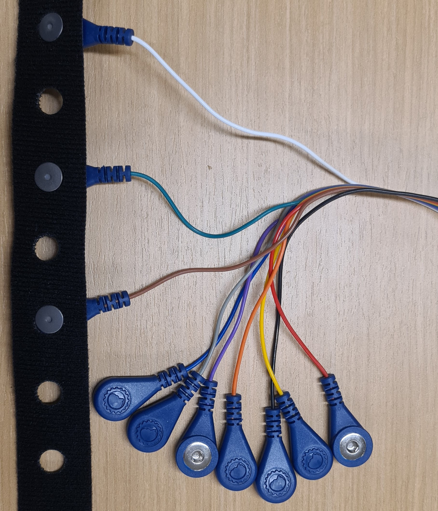
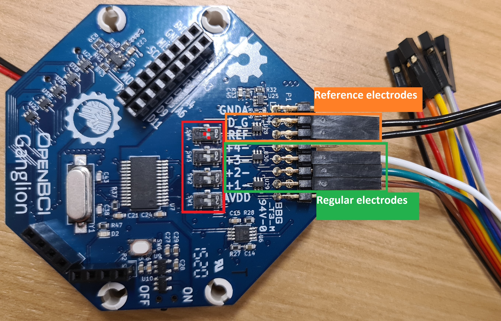
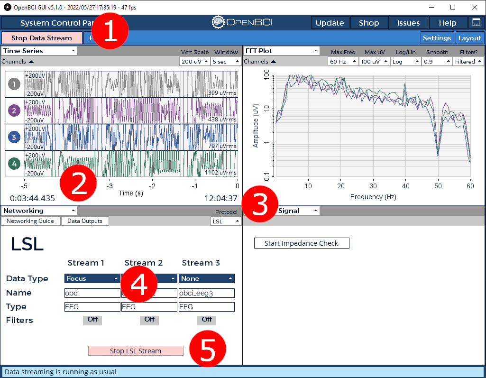

# Instructions

## Connecting the headset

### Electrode placement

I used three electrodes for my signal and connected them as shown in the image. The middle electrode should go exactly in the middle of your forehead. For more information on setting up your headband [take a look at this page](https://docs.openbci.com/AddOns/Headwear/HeadBand/).

### Ganglion board setup

For a more in-depth tutorial, see [the OpenBCI Getting Started](https://docs.openbci.com/GettingStarted/Boards/GanglionGS/). But for some extra information this is how I used the Ganglion Board.

- **Green:** The other side of the elecrodes shown above. The numbers to which you connect them does not matter, and the color of the wire does not either. Just make sure that in the OpenBCI GUI, you disable the channels you are not using. You can do so by clicking on the colored numbers under the `Time Series` panel. The colored number should turn black and the signal turns into a line.
- **Orange:** These are the reference electrodes that you clip on both ears (again, see [the headset setup](https://docs.openbci.com/AddOns/Headwear/HeadBand/))
- **Red:** Make sure to have the pins in this position, I highlighted with three small red squares. See [the Ganglion Hardware Guide](https://docs.openbci.com/Ganglion/GanglionSpecs/#inverting-input-select-switches) to learn what is does.

## Start OpenBCI to LSL stream

1. Press the green button `Start Data Stream`. The button will turn red and you'll see that the graphs start moving.
2. Select `Networking` from the dropdown list.
3. Select LSL in the dropdown list under `protocol`.
4. Change the `Data Type` to `Focus` and `Name` to `obci`.
5. Press `Start LSL Stream`.

## Start beepci.py

1. Make sure you have `Python 3.8+` installed
2. Install numpy (if not already present): `pip install numpy`
3. run in a seperate command line interface: `python beepci.py`

If the connection is successful, the commandline will start printing the value that is received through lsl from the openBCI GUI. This value represents the focus value that you have selected under the `networking` tab in the GUI, where 1 is fully focused and 0 is the opposite.

## Signal Quality

An important measure is the impedance of the signal and the lower the better. It is recommended to run the impedance check before you start running the code. A few tips to improve the quality:

- Make sure all electrodes make close contact to the skin
- Make sure your skin under the electrode and the electrode itself is clean, including the reference electrodes!.
- If no success, you can try to make your skin or the electrode slightly wet.
- Try to reduce noise from other wireless signal around you. Either turn unnecessary wireless devices off or move them away from your setup.
- Check the FFT plot (top right corner in the image) and see if there are any large peaks. For example, when I tested this code, I saw a large peak around 20 Hz and I got rid of it by applying a bandstop filter around 20 Hz. (see filter next to start/stop Data Stream in the top left corner)